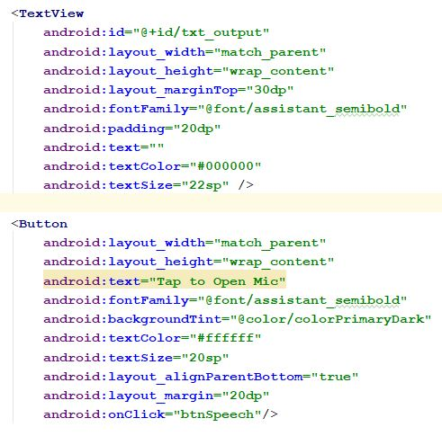
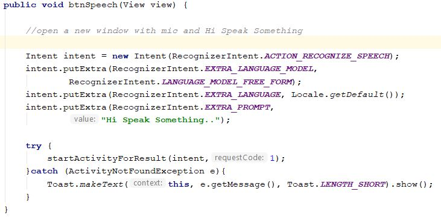
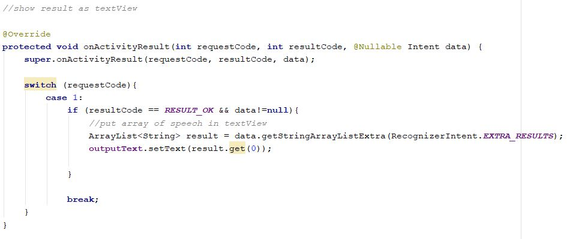
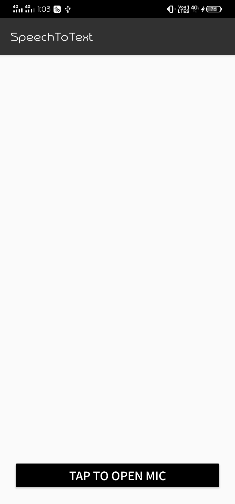
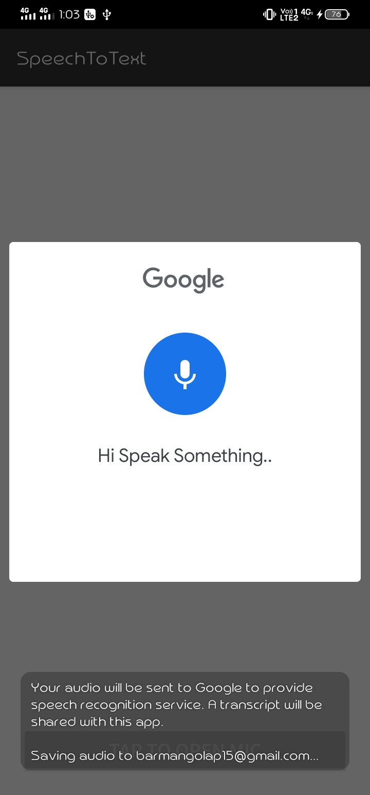
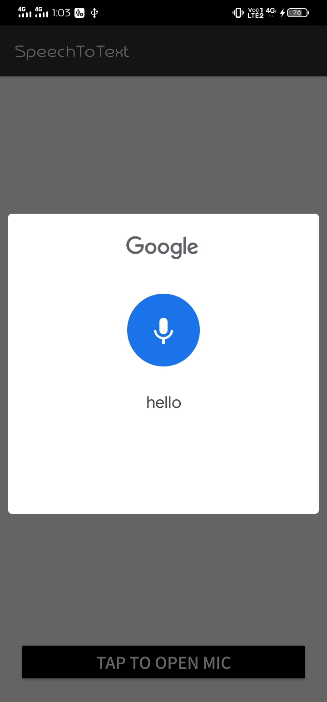
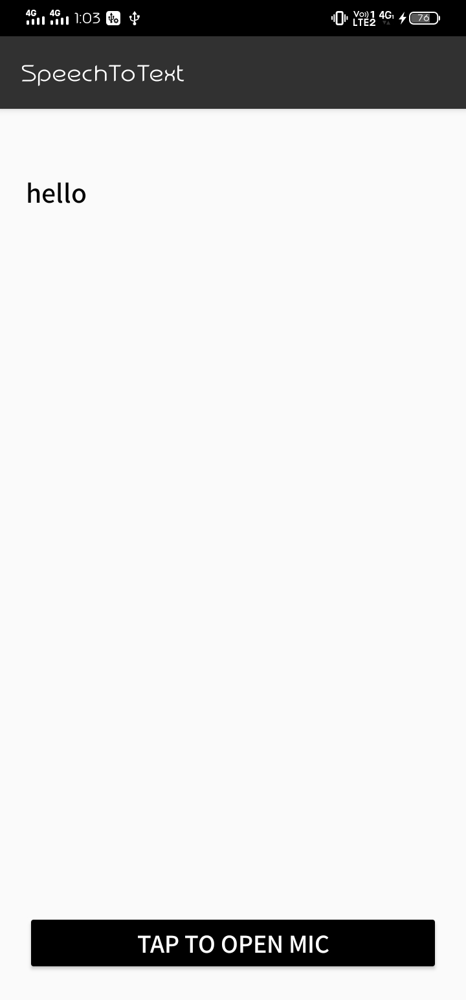

# Speech-To-Text-Converter

when we speak something this app will convert that speech into text

# Geting Started

for showing the text we need one `TextView` and for opening the mic we add one `Button` in `activity_main.xml` file

for opening the mic window we need to call `RecognizerIntent.ACTION_RECOGNIZE_SPEECH` in `MainActivity.java` file

for showing the result into `TextView` 

# ScreenShots

      
